<h1 align="center">Woow EMQX MCP Server</h1>

<p align="center">
  <strong>Production-ready MCP Admin Bundle for the EMQX MQTT Broker</strong><br/>
  Web GUI + MCP Reverse Proxy + 39-tool MCP Server in a single container
</p>

<p align="center">
  <a href="#overview">Overview</a> &bull;
  <a href="#features">Features</a> &bull;
  <a href="#architecture">Architecture</a> &bull;
  <a href="#the-39-tools">Tools</a> &bull;
  <a href="#screenshots">Screenshots</a> &bull;
  <a href="#installation">Installation</a> &bull;
  <a href="#connecting-ai-assistants">Connecting AI</a> &bull;
  <a href="#security">Security</a> &bull;
  <a href="#api-reference">API</a> &bull;
  <a href="README_zh-TW.md">中文文件</a>
</p>

<p align="center">
  
  
  
  
  
  
  
  
</p>

---

## Overview

**Woow EMQX MCP Server** turns an EMQX MQTT broker into something an AI assistant can operate
safely. It exposes the EMQX REST API v5 as **39 MCP tools**, puts a token-authenticated reverse
proxy in front of them, and ships a React admin console for configuring the lot — all in a single
container.

Ask Claude *"why did my sensor stop reporting?"* and it can list the client, check whether the
session is still alive, look at what the client is subscribed to, confirm the topic has a route,
read the retained payload, and tell you the device never reconnected after its last will fired —
without you opening a dashboard.

This bundle is the EMQX sibling of
[woow_n8n_mcp_server](https://github.com/WOOWTECH/woow_n8n_mcp_server) and shares its
`mcp_admin_core` foundation, so the operational model, GUI and proxy semantics are identical
across the WOOWTECH MCP fleet.

### Why This Bundle?

| Challenge | Solution |
|-----------|----------|
| The EMQX REST API is large and easy to misuse from an LLM | 39 curated tools with descriptions written for models, not humans |
| An open MCP endpoint would let anything drive your broker | Token-authenticated reverse proxy; the MCP server binds to `127.0.0.1` only |
| "Give the AI everything" is not an acceptable security posture | Three-level gating — category, tool, and per-operation — plus a read-only master switch |
| Destructive operations look identical to reads over MCP | Every tool carries MCP annotations; `destructiveHint` is set on all 13 dangerous tools |
| Tool configuration means editing env vars and restarting | Visual toggles in the GUI; changes are written into the subprocess env and applied on restart |
| Debugging a broken MCP server means `docker logs` | Live SSE log streaming with search, in the browser |
| Claude's connector refuses no-auth remote servers | Two ready-made Cloudflare Workers: an OAuth 2.1 gateway and a clean-404 public endpoint |

### Before vs. After

| Aspect | Raw EMQX REST API | With This Bundle |
|--------|-------------------|------------------|
| AI access | Hand-rolled HTTP calls per assistant | One MCP URL, 39 typed tools |
| Auth | API key/secret pasted into every client | Key stored once, proxy token handed out instead |
| Blast radius | Full API surface | Whatever the switches allow |
| Errors | Raw 4xx bodies | Messages that tell the model what to do next |
| Observability | Broker logs only | Dashboard health + streaming MCP logs |
| Deployment | N/A | Single container: Docker, Podman, or Kubernetes |

---

## Features

### Dashboard

Aggregated health for the whole stack in one view — the MCP server subprocess (with PID), the EMQX
broker connection (with the REST URL it is using), and the built-in reverse proxy. Below that,
the MCP Admin version, the EMQX cluster node name, and the live count of connected MQTT clients.

### Tool Manager

All 39 tools grouped into 7 categories, each with a toggle. The header shows the enabled count
(`39 of 39 tools enabled`), and a search box filters by name, description or category. Dangerous
tools are marked. Toggling writes the disabled set into the MCP server's environment and restarts
the subprocess, so the change reaches the live MCP surface — a disabled tool disappears from
`tools/list` entirely rather than failing at call time.

### Connection Configuration

Point the bundle at your broker: the EMQX Dashboard URL (base only — `/api/v5` is appended for
you), API Key and API Secret. The secret is write-only; leaving it blank keeps the stored value,
because EMQX shows a secret exactly once, at creation. **Test Connection** performs a real call
and reports the broker edition, version and node count.

### Permission Editor

A JSON policy editor for `allowed_tools` / `denied_tools`, for when a per-tool toggle is too
coarse or you want the policy under version control. Denying a tool here removes it from the MCP
surface the same way the toggle does.

### Token Manager

The MCP proxy token: masked display, one-click rotation, and the proxy URL template. Rotating
generates a new token, applies it, and restarts the proxy in one step.

### Log Viewer

Live SSE stream of the MCP server subprocess with an in-memory ring buffer, text/regex search,
pause, auto-scroll and clear. Every line is structured — timestamp, level, message, source — so
the viewer can colour and filter them.

### Settings

Full process control for the MCP subprocess (command, args, port, environment, restart), the proxy
(timeout up to 24 h, optional upstream bearer), and the admin password.

### Edge Deployment (Cloudflare)

Two Workers in [`cloudflare/`](cloudflare) solve the two ways a remote MCP endpoint typically fails
to connect from Claude:

- **`mcp-oauth-gateway.js`** — a full OAuth 2.1 authorization server at the edge: RFC 9728
  protected-resource metadata, RFC 8414 AS metadata, RFC 7591 dynamic client registration, PKCE
  S256 authorize/token, and refresh-token rotation. The upstream proxy token never leaves the edge.
- **`mcp-direct.js`** — a dedicated hostname that serves the proxy and answers every other path,
  including `/.well-known/*`, with a clean JSON 404. That 404 is what lets a connector conclude
  "no sign-in service here" and fall back to an anonymous connection.

---

## Architecture

```
┌─────────────────────────────────────────────────────────────────────┐
│                    Woow EMQX MCP Admin Bundle                       │
│                        (Single Container)                           │
├─────────────────────────────────────────────────────────────────────┤
│                                                                     │
│  ┌───────────────────────────────────────────────────────────────┐  │
│  │              React SPA (Vite + Tailwind CSS)                  │  │
│  │                                                               │  │
│  │  Dashboard │ Tools │ Connection │ Tokens │ Logs │ Permissions │  │
│  └──────────────────────────┬────────────────────────────────────┘  │
│                             │ HTTP                                  │
│  ┌──────────────────────────▼────────────────────────────────────┐  │
│  │                  FastAPI Backend (:8080)                      │  │
│  │                                                               │  │
│  │  ┌──────────┐  ┌──────────┐  ┌───────────┐  ┌──────────────┐  │  │
│  │  │   Auth   │  │  Config  │  │  Process  │  │  MCP Proxy   │  │  │
│  │  │Middleware│  │  Store   │  │  Manager  │  │  /private_*  │  │  │
│  │  └──────────┘  └──────────┘  └───────────┘  └──────┬───────┘  │  │
│  └───────────────────────────────────────────────────│──────────┘  │
│                                                      │             │
│  ┌───────────────────────────────────────────────────▼──────────┐  │
│  │        emqx_mcp_server (FastMCP, 127.0.0.1:3000)             │  │
│  │                                                               │  │
│  │  ToolGate │ 39 tools / 7 categories │ Streamable HTTP        │  │
│  └──────────────────────────┬────────────────────────────────────┘  │
│                             │ httpx (pooled, Basic auth)            │
├─────────────────────────────┼──────────────────────────────────────┤
│                             ▼                                      │
│  ┌───────────────────────────────────────────────────────────────┐  │
│  │              EMQX REST API v5 (:18083/api/v5)                 │  │
│  │   Clients │ Topics │ Retained │ AuthN/AuthZ │ Rules │ Traces  │  │
│  └───────────────────────────────────────────────────────────────┘  │
└─────────────────────────────────────────────────────────────────────┘
```

### Request path, end to end

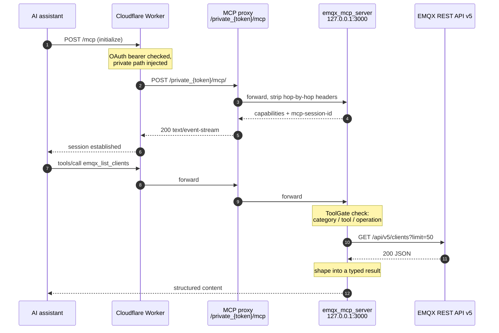

### Three-level tool gating

Every call passes the same gate. A tool that fails any level is never registered, so it does not
appear in `tools/list` at all — the model cannot even attempt it.

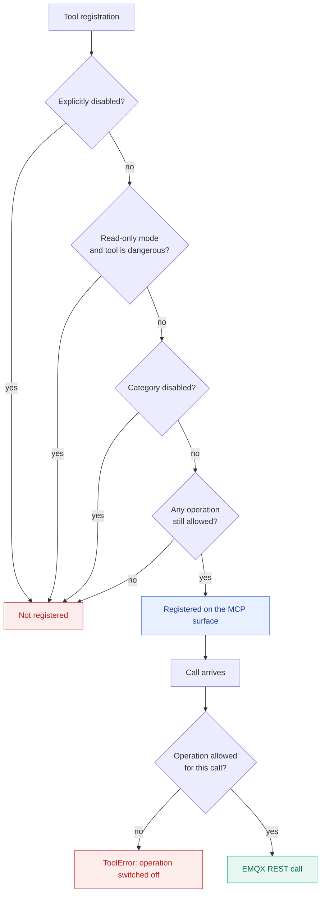

### Module dependency graph

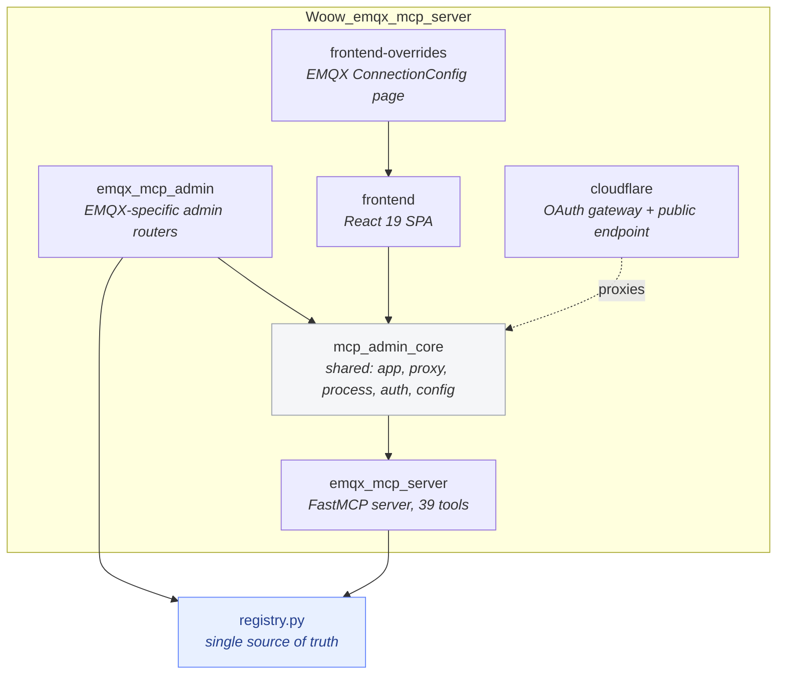

`registry.py` is deliberately shared: the GUI's tool list and the MCP server's registration loop
read the same 39 `ToolSpec` entries, so the console can never show a tool the server does not
serve. A test (`tests/test_mcp_surface.py`) asserts that parity.

### Deployment topology

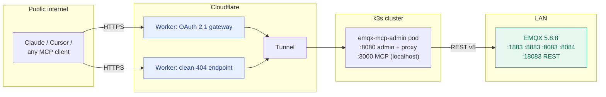

More detail, including the failure modes each layer absorbs, is in
[docs/architecture.md](docs/architecture.md).

---

## The 39 Tools

Seven categories. **13 tools are destructive** and carry `destructiveHint` in their MCP
annotations; the rest are marked `readOnlyHint`. Tools with an *Operations* column can be
restricted further — you can allow `read` on `emqx_manage_authn_users` while denying `create` and
`delete`.

### Cluster & Monitoring (7)

| Tool | Description |
|------|-------------|
| `emqx_cluster_status` | Cluster nodes with version, uptime, CPU and memory |
| `emqx_node_detail` | Full detail for one node, including load and connection counts |
| `emqx_broker_stats` | Live counters: connections, sessions, subscriptions, topics |
| `emqx_metrics_current` | Current throughput gauges used by the dashboard charts |
| `emqx_metrics_history` | Time-series metrics over a recent window |
| `emqx_list_alarms` | Active and historical broker alarms |
| `emqx_prometheus_stats` | Raw Prometheus exposition text for scraping or diffing |

### Client Management (6)

| Tool | Description | Destructive | Operations |
|------|-------------|:-----------:|------------|
| `emqx_list_clients` | MQTT clients known to the broker, with filters | | read |
| `emqx_get_client` | Full session detail for a single client | | read |
| `emqx_client_subscriptions` | Topics a specific client is subscribed to | | read |
| `emqx_kick_client` | Forcibly disconnect a client and clear its session | ⚠ | delete |
| `emqx_client_subscribe` | Subscribe a client to a topic on its behalf | ⚠ | create |
| `emqx_client_unsubscribe` | Remove a subscription from a client on its behalf | ⚠ | delete |

### Topics & Subscriptions (2)

| Tool | Description |
|------|-------------|
| `emqx_list_topics` | Routed topics currently present in the cluster |
| `emqx_list_subscriptions` | All subscriptions cluster-wide, filterable by topic or client |

`emqx_list_subscriptions` accepts `match_topic`: give it a concrete topic and it tells you exactly
which subscribers would receive a message published there. That single parameter answers most
"I published and nothing happened" questions.

### Messaging (5)

| Tool | Description | Destructive | Operations |
|------|-------------|:-----------:|------------|
| `emqx_publish` | Publish one MQTT message through the broker | ⚠ | create |
| `emqx_publish_bulk` | Publish a batch of messages in one call (max 50) | ⚠ | create |
| `emqx_list_retained` | Retained messages the broker is holding | | read |
| `emqx_get_retained` | The retained message stored for one topic | | read |
| `emqx_delete_retained` | Delete the retained message for one topic | ⚠ | delete |

Three real-broker behaviours are handled here rather than left to the model: EMQX answers `202`
with `reason_code 16` when a publish had no subscribers (surfaced as
`delivered_to_subscribers: false`), retained payloads come back base64-encoded (decoded
transparently), and EMQX rejects a slash inside the retained-message path segment, so hierarchical
topics fall back to a listing scan for reads and an empty retained publish for deletes.

### Access Control (8)

| Tool | Description | Destructive | Operations |
|------|-------------|:-----------:|------------|
| `emqx_list_authn` | Authenticator chain and each authenticator's status | | read |
| `emqx_manage_authn_users` | List, create and delete MQTT users in the built-in database | ⚠ | create, delete, read |
| `emqx_list_authz_sources` | Authorization sources and their order in the chain | | read |
| `emqx_authz_settings` | Global authorization behaviour: no-match, deny action, cache | | read |
| `emqx_manage_authz_rules` | Read and write built-in-database ACL rules | ⚠ | create, delete, read |
| `emqx_list_banned` | Current ban list entries | | read |
| `emqx_ban` | Ban a client id, username or IP from connecting | ⚠ | create |
| `emqx_unban` | Lift a ban | ⚠ | delete |

### Diagnostics (5)

| Tool | Description | Destructive | Operations |
|------|-------------|:-----------:|------------|
| `emqx_list_traces` | Packet traces currently defined on the broker | | read |
| `emqx_create_trace` | Start a packet trace for a client, topic or IP | ⚠ | create |
| `emqx_get_trace_log` | Read the captured log for a trace | | read |
| `emqx_delete_trace` | Delete a trace; unflushed events are lost | ⚠ | delete |
| `emqx_list_listeners` | Listeners with bind addresses and running state | | read |

### Data Integration (6)

| Tool | Description | Destructive | Operations |
|------|-------------|:-----------:|------------|
| `emqx_list_rules` | Rule-engine rules with their SQL and enabled state | | read |
| `emqx_get_rule_metrics` | Match, pass and failure counters for one rule | | read |
| `emqx_toggle_rule` | Enable or disable a rule | ⚠ | update |
| `emqx_test_rule_sql` | Dry-run rule SQL against a sample event, saving nothing | | read |
| `emqx_list_connectors` | Data-integration connectors and their health | | read |
| `emqx_list_actions` | Outbound actions (bridges) and their health | | read |

---

## Screenshots

All screenshots are from a live deployment: EMQX **5.8.8 Opensource**, node
`emqx@woowtechshowha.local`, reached over the LAN at `192.168.2.189:18083`, with the bundle running
in k3s behind a Cloudflare Tunnel.

### Login

JWT authentication with the admin password. The token is stored in an httpOnly cookie; every
`/api/*` route except the login endpoint and `/healthz` requires it.

<p align="center">
  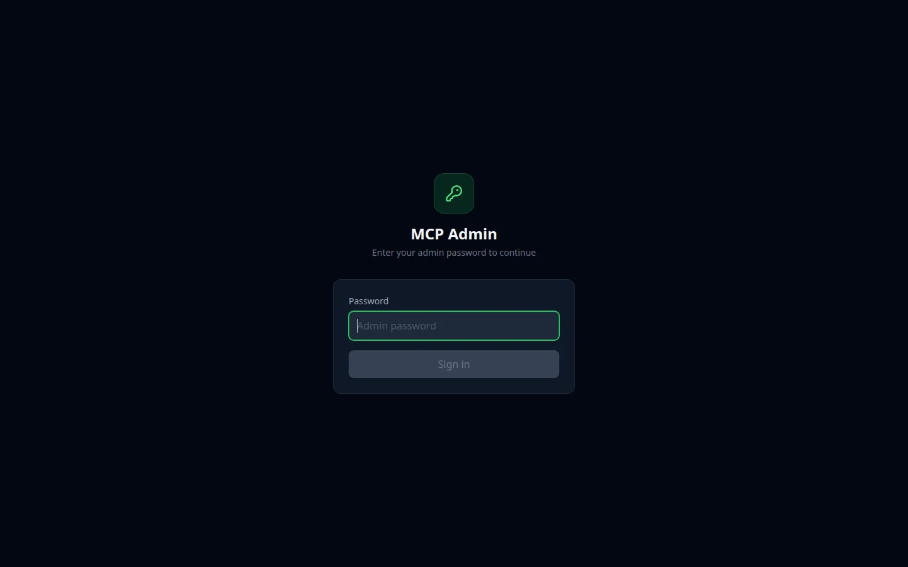
</p>

### Dashboard

Three status cards across the top — **MCP SERVER** (Online, with the subprocess PID), **EMQX
BROKER** (Connected, showing the REST base URL actually in use) and **MCP PROXY** (Active). The
Details row underneath carries the MCP Admin version, the EMQX cluster node name
(`emqx@woowtechshowha.local`) and the count of connected MQTT clients, read live from
`/api/v5/stats`.

<p align="center">
  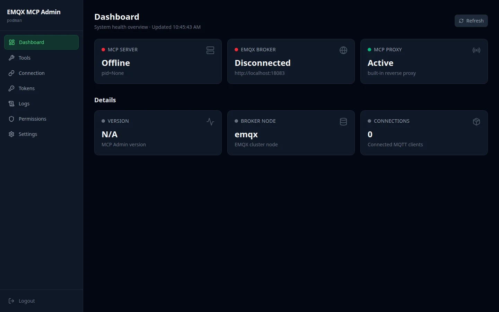
</p>

### Tool Manager

`39 of 39 tools enabled`, grouped by category with a per-tool toggle and a search box. Access
Control is expanded here, showing all eight of its tools with the one-line descriptions the model
also sees. Switching a tool off rewrites the subprocess environment and restarts it, so the tool
leaves `tools/list` — it is not merely blocked at call time.

<p align="center">
  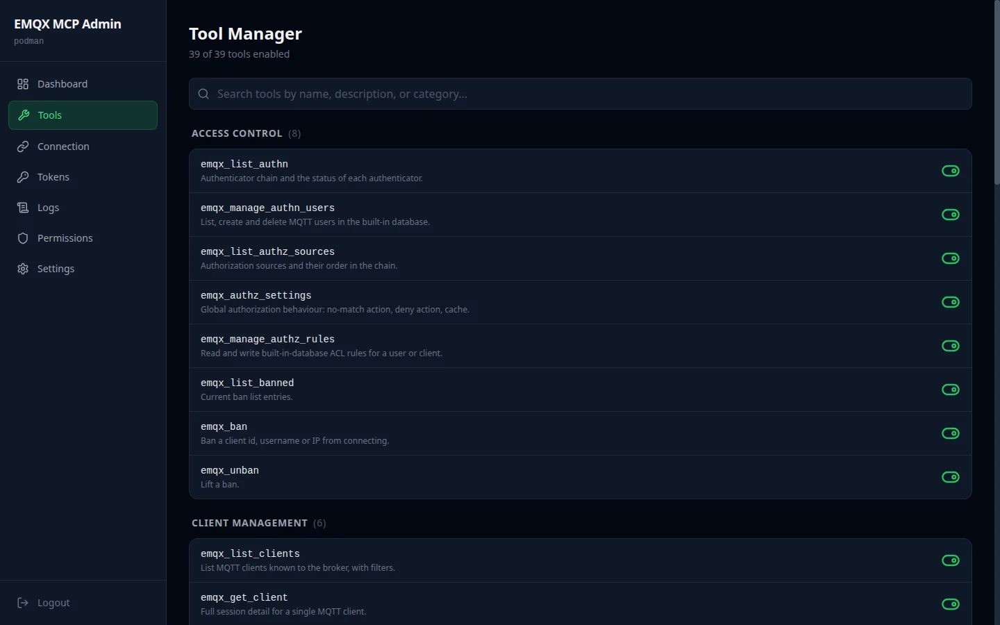
</p>

### EMQX Connection

The broker's REST endpoint and credentials. Only the base URL is entered — `/api/v5` is appended
automatically, which is the single most common configuration mistake this removes. The API Secret
field is masked and write-only: leave it blank and the stored secret is kept, because EMQX only
ever shows a secret once, at creation time.

<p align="center">
  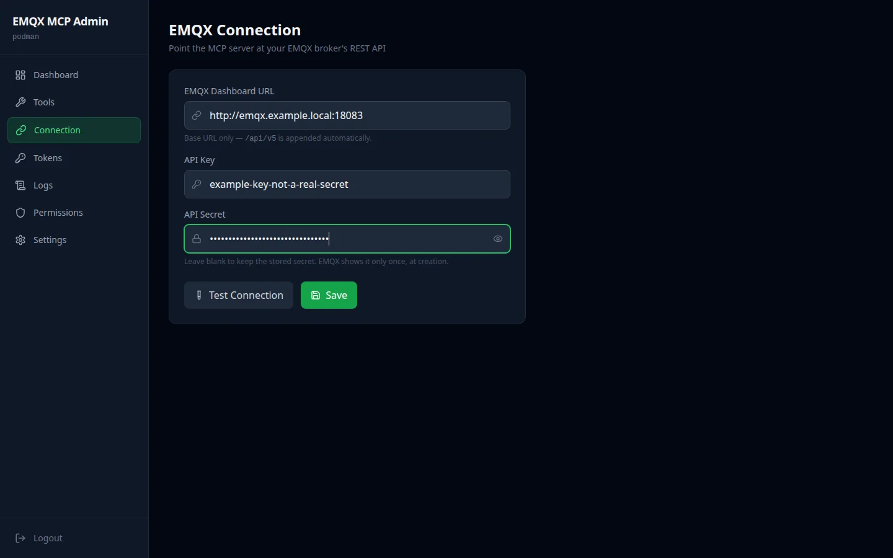
</p>

### Token Manager

The MCP proxy token, masked to first and last four characters, with the proxy URL template
underneath and one-click rotation. Rotating generates, applies and restarts in a single action.

<p align="center">
  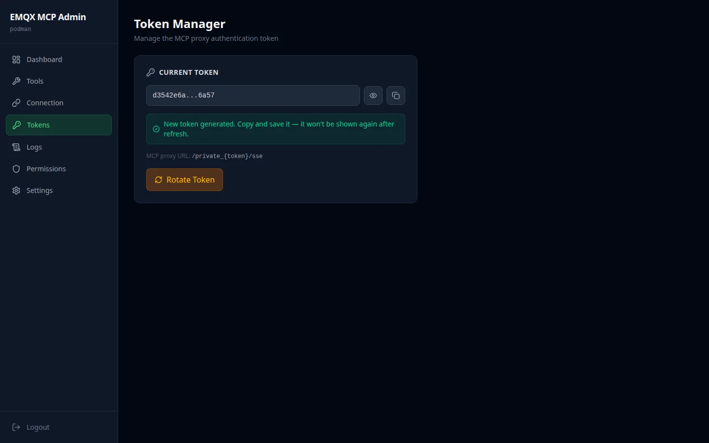
</p>

### Permission Editor

The same gating expressed as a JSON policy — `allowed_tools` and `denied_tools` — for when you
want the policy reviewable in a diff rather than clicked into a form. Format, Reset and Save;
denying a tool here removes it from the MCP surface exactly as the toggle does.

<p align="center">
  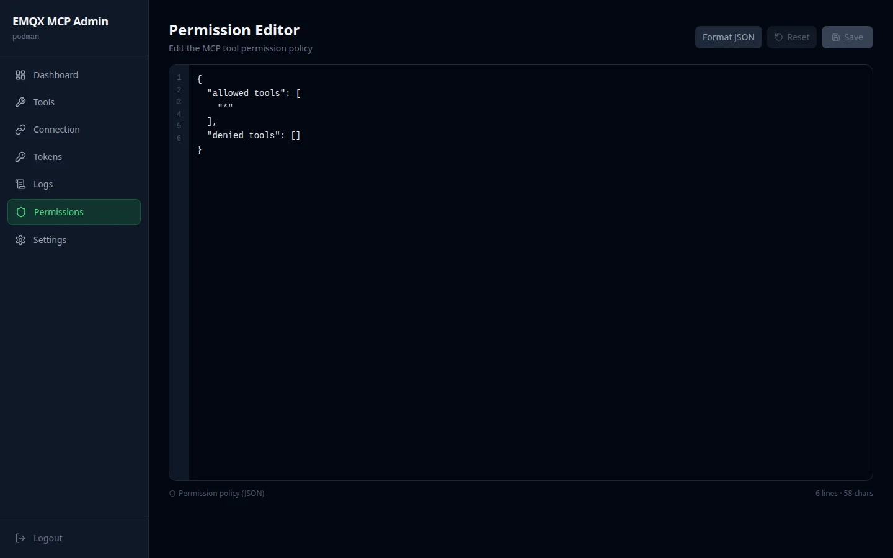
</p>

### Log Viewer

Live SSE stream from the MCP subprocess, connected and holding 200 lines. Each line carries its
own level parsed from the child process — here, a run of `POST /mcp/` requests from a connected
assistant, with `202 Accepted` for notifications and `200 OK` for calls. Pause, auto-scroll, clear
and a filter box sit above a 5000-line ring buffer.

<p align="center">
  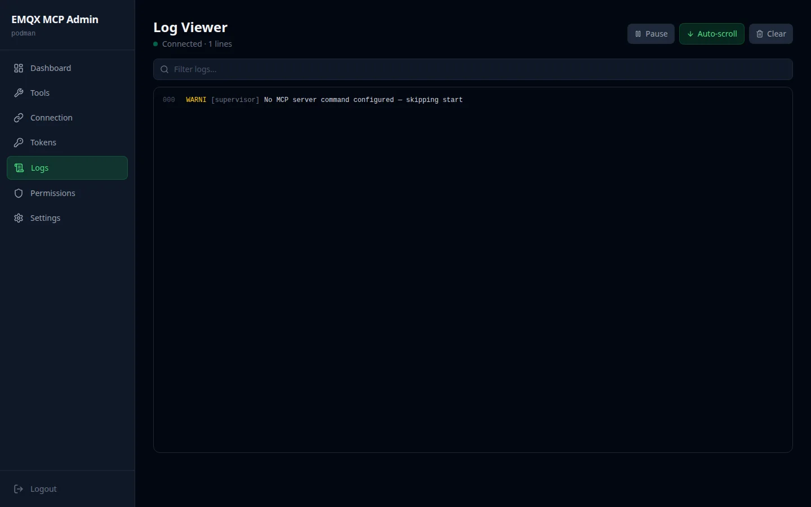
</p>

### Settings

Process control for the MCP subprocess: running state, PID, restart count, and the exact command
line — `python3 -m emqx_mcp_server.server --transport http --host 127.0.0.1 --port 3000`. Binding
to `127.0.0.1` is deliberate: the MCP server is reachable only through the authenticated proxy,
never directly. Proxy timeout and admin password live further down the page.

<p align="center">
  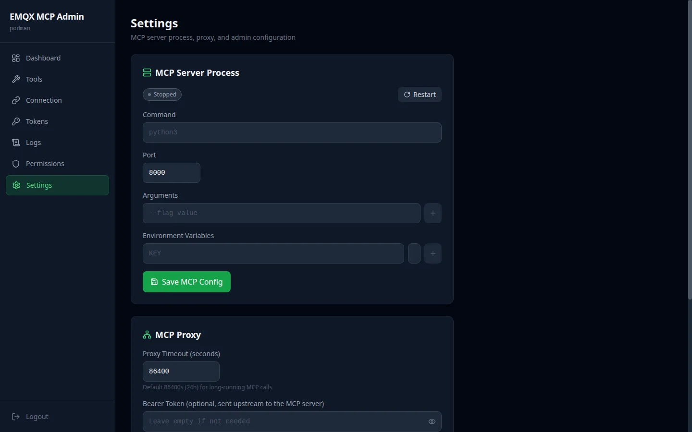
</p>

---

## Installation

### Prerequisites

- **EMQX 5.8+** with the Dashboard REST API reachable (default port `18083`)
- An EMQX **API Key / Secret** pair (EMQX Dashboard → System → API Key)
- **Docker**, **Podman** or **Kubernetes**
- For development: **Python 3.12+** and **Node.js 20**

### Option 1: Docker / Podman

```bash
git clone https://github.com/WOOWTECH/Woow_emqx_mcp_server.git
cd Woow_emqx_mcp_server

docker build -t emqx-mcp-admin .

docker run -d \
  --name emqx-mcp-admin \
  -p 8080:8080 \
  -v ./data:/data \
  emqx-mcp-admin
```

Open `http://localhost:8080` and log in. Configure the broker on the Connection page.

### Option 2: Docker Compose

```bash
docker compose up -d
```

### Option 3: Kubernetes

```bash
kubectl apply -f k8s-deploy.yaml
kubectl -n emqx-mcp get pods
```

The manifest creates the namespace, a Secret holding `config.json`, a Deployment with readiness
and liveness probes on `/healthz`, and a ClusterIP Service on `:8080`. An init container seeds
`/data/config.json` from the Secret on every start, so the Secret is the source of truth.

### Option 4: Development

```bash
pip install -e .
pip install -e ".[dev]"

cd frontend && npm install && npm run build && cd ..

export EMQX_MCP_BASE_URL=http://your-broker:18083
export EMQX_MCP_API_KEY=...
export EMQX_MCP_API_SECRET=...

# MCP server alone, over stdio
python -m emqx_mcp_server.server

# or the full admin bundle
uvicorn emqx_mcp_admin.main:app --port 8080
```

---

## Configuration

All settings live in `/data/config.json`:

```json
{
  "admin_password": "change-me",
  "mcp_auth_token": "32-char-url-safe-token",
  "connection": {
    "emqx_mcp_base_url": "http://192.168.2.189:18083",
    "emqx_mcp_api_key": "your-api-key",
    "emqx_mcp_api_secret": "your-api-secret"
  },
  "tools": {
    "disabled_tools": [],
    "disabled_categories": [],
    "disabled_operations": {},
    "readonly": false,
    "permissions": { "allowed_tools": ["*"], "denied_tools": [] }
  },
  "mcp_server": {
    "command": "python3",
    "args": ["-m", "emqx_mcp_server.server", "--transport", "http",
             "--host", "127.0.0.1", "--port", "3000"],
    "port": 3000,
    "env": {
      "EMQX_MCP_DISABLED_CATEGORIES": "",
      "EMQX_MCP_DISABLED_TOOLS": "",
      "EMQX_MCP_DISABLED_OPERATIONS": "{}",
      "EMQX_MCP_READONLY": "false"
    }
  },
  "proxy": { "timeout": 86400, "bearer_token": "" },
  "token_history": []
}
```

### Environment variables

| Variable | Default | Description |
|----------|---------|-------------|
| `MCP_ADMIN_CONFIG` | `/data/config.json` | Path to the configuration file |
| `JWT_SECRET` | random | JWT signing secret — **set this in production**, or sessions break on restart |
| `JWT_EXPIRY_HOURS` | `24` | Admin session lifetime |
| `EMQX_MCP_BASE_URL` | — | EMQX dashboard base URL (no `/api/v5`) |
| `EMQX_MCP_API_KEY` | — | EMQX API key |
| `EMQX_MCP_API_SECRET` | — | EMQX API secret |
| `EMQX_MCP_READONLY` | `false` | Master switch: drop every destructive tool |
| `EMQX_MCP_DISABLED_TOOLS` | empty | Comma-separated tool names |
| `EMQX_MCP_DISABLED_CATEGORIES` | empty | Comma-separated category names |
| `EMQX_MCP_DISABLED_OPERATIONS` | `{}` | JSON map of tool → disabled operations |
| `EMQX_MCP_DEFAULT_LIMIT` | `50` | Default page size for list tools |
| `EMQX_MCP_MAX_LIMIT` | `200` | Hard cap on page size |

---

## Connecting AI Assistants

The proxy exposes the MCP server at `/private_{token}/mcp/`. **The trailing slash matters** — the
upstream redirects the slashless form, and a cross-host redirect drops the request.

### Direct, on your own network

```
http://your-server:8080/private_{token}/mcp/
```

### Claude Code / Cursor / any URL-based client

```bash
claude mcp add --transport http woow-emqx \
  https://your-host/private_{token}/mcp/
```

### Claude's custom-connector UI

The connector runs OAuth discovery before it connects, so a bare proxy URL fails with *"Couldn't
register with … sign-in service"*. Deploy one of the Workers in [`cloudflare/`](cloudflare):

| Worker | URL shape | Auth | Use when |
|--------|-----------|------|----------|
| `mcp-direct.js` | `https://host/mcp` or `https://host/private_{token}/mcp` | path token only | You want the same shape as the rest of the WOOWTECH MCP fleet |
| `mcp-oauth-gateway.js` | `https://host/mcp` | OAuth 2.1 + password | The endpoint is public and you want real authentication |

Both keep the upstream token at the edge and normalise the trailing slash. See
[docs/architecture.md](docs/architecture.md) for why the clean 404 matters.

---

## API Reference

### Authentication

| Method | Endpoint | Description |
|--------|----------|-------------|
| `POST` | `/api/auth/login` | Authenticate with the admin password, returns a JWT |

### Dashboard

| Method | Endpoint | Description |
|--------|----------|-------------|
| `GET` | `/api/health` | Aggregated health: MCP server, broker, proxy, version, node, connections |

### Connection

| Method | Endpoint | Description |
|--------|----------|-------------|
| `GET` | `/api/config` | Current connection settings, secret masked |
| `PUT` | `/api/config/connection` | Update base URL, API key, API secret |
| `POST` | `/api/config/test` | Live connectivity test; returns edition, version, node count |
| `PUT` | `/api/config/permissions` | Replace the allow/deny tool policy |

### Tools

| Method | Endpoint | Description |
|--------|----------|-------------|
| `GET` | `/api/tools` | All 39 tools with category, description and enabled state |
| `PUT` | `/api/tools` | Apply a tool enable/disable set and restart the subprocess |
| `PUT` | `/api/tools/operations` | Update per-tool disabled operations |

### Tokens

| Method | Endpoint | Description |
|--------|----------|-------------|
| `GET` | `/api/tokens` | Current token, masked, plus rotation history |
| `POST` | `/api/tokens/rotate` | Generate, apply and restart in one step |
| `PUT` | `/api/tokens` | Set a specific token value |

### Logs

| Method | Endpoint | Description |
|--------|----------|-------------|
| `GET` | `/api/logs/stream` | SSE stream, replays the recent buffer then follows |
| `GET` | `/api/logs/search` | Text or regex search across the ring buffer |

### Settings

| Method | Endpoint | Description |
|--------|----------|-------------|
| `GET` | `/api/settings` | Full config with secrets masked |
| `PUT` | `/api/settings/{section}` | Replace one config section |
| `GET` | `/api/settings/mcp/status` | Subprocess status: running, pid, restart count |
| `POST` | `/api/settings/mcp/restart` | Restart the MCP subprocess |

### System

| Method | Endpoint | Description |
|--------|----------|-------------|
| `GET` | `/healthz` | Kubernetes-compatible health check, unauthenticated |
| `ANY` | `/private_{token}/mcp/` | The MCP endpoint itself |

---

## Security

### Authentication layers

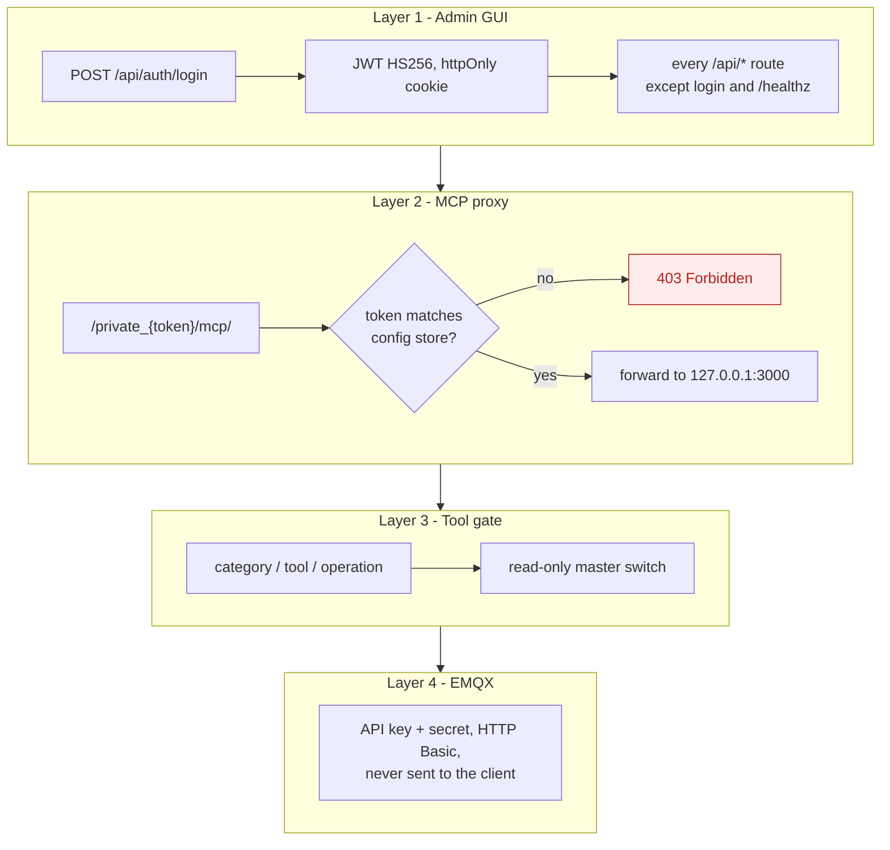

### Security properties

- **The MCP server is never directly exposed.** It binds to `127.0.0.1:3000`; the only route in is
  the token-authenticated proxy.
- **EMQX credentials never reach the client.** They live in the config store and are used
  server-side for HTTP Basic auth. The API secret is write-only through the API.
- **Constant-time password comparison** via `secrets.compare_digest`.
- **Injected dependencies are stripped from the tool schema**, so a model can neither see nor
  override the HTTP client.
- **Error messages are actionable, not leaky.** `mask_error_details` is on; unexpected exceptions
  become a generic message while deliberate `ToolError`s reach the model verbatim.
- **Every response is `Cache-Control: no-store`**, so a CDN in front cannot serve one operator's
  view to another.
- **Destructive tools are declared as such** in MCP annotations, so a well-behaved client can ask
  for confirmation before calling them.

### Hardening checklist

1. Change `admin_password` on first login.
2. Set `JWT_SECRET` explicitly.
3. Rotate `mcp_auth_token` after handing it to anyone, and use the OAuth gateway for public
   exposure rather than the path token.
4. Give the bundle an EMQX API key scoped to what it actually needs.
5. Turn on `readonly` for assistants that only need to observe.
6. Put the MCP endpoint on its own hostname — never share one with the admin GUI.

---

## Testing

```bash
pip install -e ".[dev]"
pytest -v
```

| Test file | Covers | Tests |
|-----------|--------|-------|
| `test_gating.py` | Three-level gating and the read-only switch | 7 |
| `test_mcp_surface.py` | Registration, annotations, registry ↔ server parity | 6 |
| `test_admin_tools_api.py` | `/api/tools` shapes and the subprocess-env write path | 4 |
| `test_connection_wiring.py` | Config keys reach the subprocess as `EMQX_MCP_*` | 3 |
| `test_retained_topics.py` | Slash-in-topic fallbacks, base64 payloads | 3 |
| `test_log_stream.py` | Log capture, classification and SSE framing | 1 |
| `test_client_lifetime.py` | The pooled client survives more than one tool call | 2 |
| **Total** | | **26 passing**, 11 live-broker tests skipped without credentials |

The live-broker tests run against a real EMQX when `EMQX_MCP_BASE_URL`, `EMQX_MCP_API_KEY` and
`EMQX_MCP_API_SECRET` are set.

### Verified against a real deployment

| Suite | Result |
|-------|--------|
| GUI + MCP audit over public HTTPS (endpoints, shapes, EMQX semantics, behaviour, security) | **64 / 64** |
| Cloudflare OAuth gateway (discovery, DCR, PKCE, tokens, security, MCP) | **29 / 29** |
| Public endpoint shape (clean 404s, slash forms, token rejection, tool calls) | **15 / 15** |

---

## Tech Stack

| Component | Technology | Version |
|-----------|-----------|---------|
| MCP server | FastMCP | 3.4+ |
| Backend | FastAPI + Uvicorn | 0.115+, Python 3.12 |
| Frontend | React + Tailwind CSS + Vite | React 19, Tailwind 3.4, Vite 6 |
| HTTP client | httpx | pooled `AsyncClient` |
| Auth | PyJWT | HS256 |
| Broker | EMQX | 5.8+ (tested on 5.8.8 Opensource) |
| Transport | MCP Streamable HTTP | 2025-06-18 |
| Edge | Cloudflare Workers | ES modules |
| Container | Docker / Podman | multi-stage |
| Orchestration | Kubernetes / k3s | v1.31+ |

---

## Project Structure

```
Woow_emqx_mcp_server/
├── emqx_mcp_server/            # The MCP server
│   ├── server.py               # build_server(): FastMCP app factory
│   ├── registry.py             # 39 ToolSpecs - shared with the GUI
│   ├── gating.py               # ToolGate: category / tool / operation
│   ├── deps.py                 # EmqxHttp: borrowed, non-closeable client handle
│   ├── errors.py               # EMQX failures -> actionable ToolErrors
│   ├── lifespan.py             # pooled httpx client
│   ├── models.py               # typed results
│   ├── settings.py             # EMQX_MCP_* settings
│   └── tools/                  # cluster, clients, topics, messaging,
│                               # security, diagnostics, integration
├── emqx_mcp_admin/             # EMQX-specific admin layer
│   ├── main.py                 # create_app(extra_routers=[...])
│   └── routers/                # config, tools, health, logs, tokens
├── mcp_admin_core/             # Shared core (app, proxy, process, auth, config)
├── frontend/                   # React 19 SPA
├── frontend-overrides/         # EMQX ConnectionConfig page
├── cloudflare/                 # Edge Workers
│   ├── mcp-oauth-gateway.js    # OAuth 2.1 authorization server
│   └── mcp-direct.js           # clean-404 public endpoint
├── docs/
│   ├── architecture.md
│   └── screenshots/
├── tests/                      # 26 passing, 11 live-broker
├── Dockerfile
├── docker-compose.yml
├── k8s-deploy.yaml
├── pyproject.toml
└── README_zh-TW.md
```

---

## Changelog

### v1.0.0 (2026-08)

- **Initial release** — full EMQX MCP Admin Bundle
- **39 MCP tools** across 7 categories, built test-first with FastMCP 3.4
- **Three-level gating** — category, tool and per-operation — plus a read-only master switch
- **Admin console** — Dashboard, Tool Manager, Connection, Tokens, Permissions, Logs, Settings
- **MCP proxy** — token-authenticated reverse proxy, MCP server bound to `127.0.0.1`
- **Cloudflare Workers** — OAuth 2.1 gateway and clean-404 public endpoint
- **Live-broker fixes** — retained topics containing slashes, base64 payloads, and the `202` /
  `reason_code 16` "no matching subscribers" case
- **Fix** — FastMCP's `Depends` entered and exited the pooled `httpx.AsyncClient`, closing it after
  the first tool; every second call in a session failed with *"Cannot reopen a client instance"*.
  The provider now returns `EmqxHttp`, a borrowed handle that is deliberately not a context
  manager. Pinned by `tests/test_client_lifetime.py`
- **Fix** — tool switches were written to the config file but never reached the subprocess
  environment, so toggles had no effect on the live MCP surface
- **Fix** — log capture set the handler but not the logger level, so INFO lines were dropped by the
  root logger before reaching the buffer and the Log Viewer showed nothing
- **Testing** — 26 unit tests, plus 64/64, 29/29 and 15/15 audits against a live EMQX 5.8.8

---

## Support

- **Issues:** [GitHub Issues](https://github.com/WOOWTECH/Woow_emqx_mcp_server/issues)
- **Email:** service@woowtech.io
- **Sibling project:** [woow_n8n_mcp_server](https://github.com/WOOWTECH/woow_n8n_mcp_server)

---

## License

MIT — see [LICENSE](LICENSE).

---

<p align="center">
  <sub>Built by <a href="https://github.com/WOOWTECH">WOOWTECH</a> &bull; Powered by EMQX + MCP</sub>
</p>
