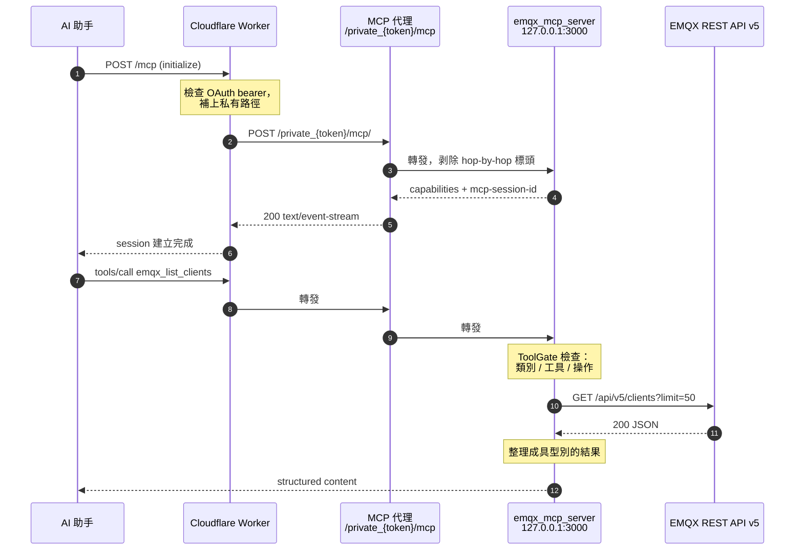
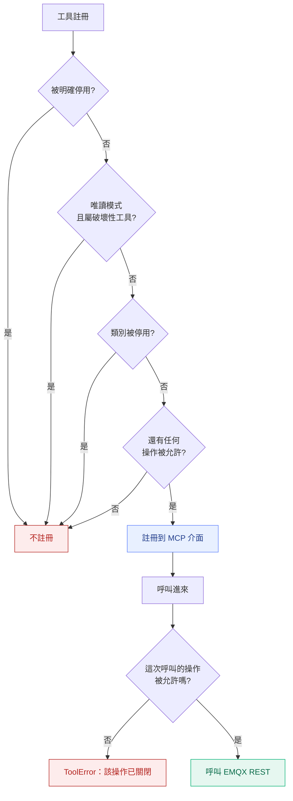
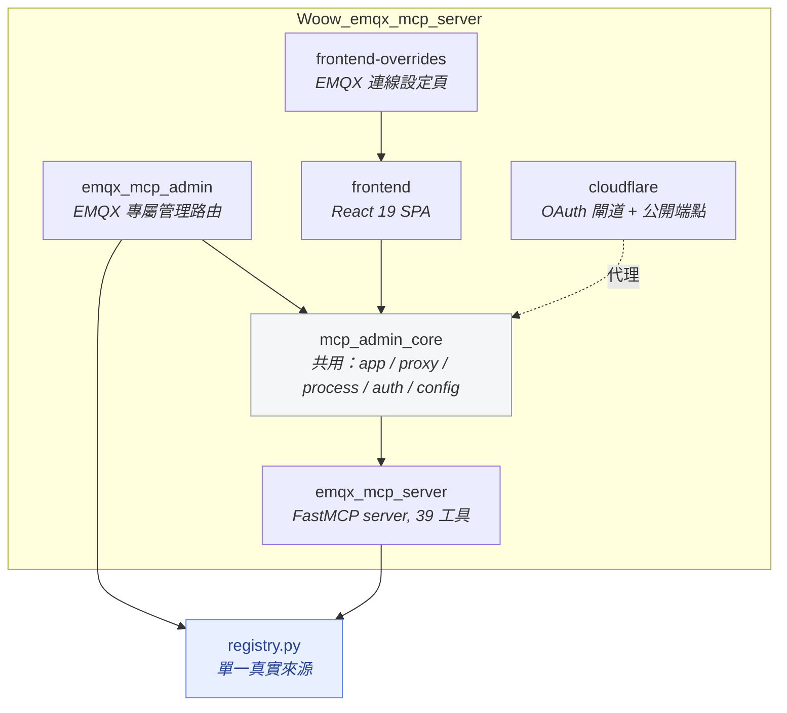
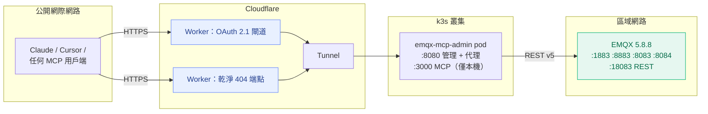
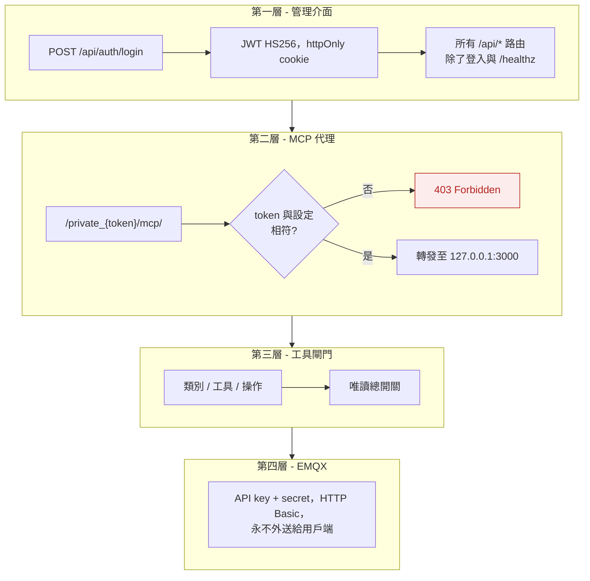

<h1 align="center">Woow EMQX MCP Server</h1>

<p align="center">
  <strong>EMQX MQTT Broker 的生產級 MCP 管理套件</strong><br/>
  Web 管理介面 + MCP 反向代理 + 39 個工具的 MCP Server，單一容器交付
</p>

<p align="center">
  <a href="#專案簡介">簡介</a> &bull;
  <a href="#功能">功能</a> &bull;
  <a href="#架構">架構</a> &bull;
  <a href="#39-個工具">工具</a> &bull;
  <a href="#畫面截圖">截圖</a> &bull;
  <a href="#安裝">安裝</a> &bull;
  <a href="#串接-ai-助手">串接 AI</a> &bull;
  <a href="#安全性">安全性</a> &bull;
  <a href="#api-參考">API</a> &bull;
  <a href="README.md">English</a>
</p>

<p align="center">
  
  
  
  
  
  
  
  
</p>

---

## 專案簡介

**Woow EMQX MCP Server** 讓 AI 助手能夠安全地操作 EMQX MQTT broker。它把 EMQX REST API v5
包裝成 **39 個 MCP 工具**，前面擋一層 token 驗證的反向代理，再附上一套 React 管理主控台，
全部打包進單一容器。

你可以直接問 Claude「為什麼我的感測器不回報了？」，它會列出該用戶端、確認 session 還在不在、
查它訂閱了哪些主題、確認主題有沒有路由、讀出 retained 訊息，然後告訴你這台裝置在遺嘱訊息
發出後就沒有再連回來 —— 全程你不需要打開任何儀錶板。

本專案是 [woow_n8n_mcp_server](https://github.com/WOOWTECH/woow_n8n_mcp_server) 的 EMQX 版本，
共用同一套 `mcp_admin_core` 基底，所以整個 WOOWTECH MCP 系列的操作模式、管理介面與代理語意
完全一致。

### 為什麼需要這套？

| 問題 | 解法 |
|------|------|
| EMQX REST API 面很大，LLM 很容易用錯 | 39 個精選工具，說明文字是寫給模型看的，不是寫給人看的 |
| 開放的 MCP 端點等於把 broker 交給任何人 | Token 驗證反向代理；MCP server 只綁 `127.0.0.1` |
| 「權限全開給 AI」不是可接受的安全姿態 | 三層開關 —— 類別、單一工具、單一操作 —— 外加唯讀總開關 |
| 破壞性操作在 MCP 上跟讀取長得一樣 | 每個工具都帶 MCP annotations，13 個危險工具都標了 `destructiveHint` |
| 調整工具要改環境變數再重啟 | 介面上直接切換；設定會寫進子行程環境並自動重啟 |
| 除錯只能去翻 `docker logs` | 瀏覽器裡即時 SSE 日誌串流，可搜尋 |
| Claude 連接器不接受無驗證的遠端伺服器 | 附兩支現成 Cloudflare Worker：OAuth 2.1 閘道與乾淨 404 端點 |

### 導入前後對照

| 面向 | 直接用 EMQX REST API | 使用本套件 |
|------|---------------------|-----------|
| AI 存取 | 每個助手各自手刻 HTTP 呼叫 | 一個 MCP 網址，39 個具型別的工具 |
| 驗證 | API key/secret 貼到每個用戶端 | 金鑰只存一次，對外只發代理 token |
| 影響範圍 | 整個 API 面 | 開關允許的範圍 |
| 錯誤訊息 | 原始 4xx 內容 | 直接告訴模型下一步該做什麼 |
| 可觀測性 | 只有 broker 日誌 | 儀錶板健康狀態 + MCP 日誌串流 |
| 部署 | 無 | 單一容器：Docker、Podman 或 Kubernetes |

---

## 功能

### 儀錶板（Dashboard）

一頁看完整套堆疊的健康狀態 —— MCP server 子行程（含 PID）、EMQX broker 連線（含實際使用的
REST 網址）、內建反向代理。下方細節列出 MCP Admin 版本、EMQX 叢集節點名稱，以及即時的
MQTT 用戶端連線數。

### 工具管理（Tool Manager）

39 個工具依 7 個類別分組，每個都有開關。標題顯示啟用數量（`39 of 39 tools enabled`），
搜尋框可依名稱、說明或類別過濾，危險工具有標記。切換開關會把停用清單寫進 MCP server 的
環境變數並重啟子行程，所以變更會真的反映到 MCP 介面上 —— 被關掉的工具會從 `tools/list`
消失，而不是等到呼叫時才擋。

### 連線設定（Connection）

指定 broker：EMQX Dashboard 網址（只填基底，`/api/v5` 會自動接上）、API Key、API Secret。
Secret 欄位是唯寫的，留白代表沿用已儲存的值 —— 因為 EMQX 只在建立當下顯示一次 secret。
**Test Connection** 會實際打一次 API，回報 broker 版本、版本類型與節點數。

### 權限編輯器（Permission Editor）

用 JSON 政策表達 `allowed_tools` / `denied_tools`，適合單一工具開關太粗、或你想把政策納入
版本控制的情境。在這裡 deny 掉的工具，同樣會從 MCP 介面上消失。

### Token 管理（Token Manager）

MCP 代理 token：遮罩顯示、一鍵輪替、代理網址範本。輪替會一次完成產生、套用、重啟代理。

### 日誌檢視（Log Viewer）

MCP server 子行程的即時 SSE 串流，搭配記憶體環形緩衝區、文字／正規表達式搜尋、暫停、
自動捲動與清除。每一行都是結構化的（時間戳、等級、訊息、來源），所以介面能上色與過濾。

### 系統設定（Settings）

完整的子行程控制（指令、參數、連接埠、環境變數、重啟）、代理設定（逾時最長 24 小時、
可選的上游 bearer）、以及管理密碼。

### 邊緣部署（Cloudflare）

[`cloudflare/`](cloudflare) 裡的兩支 Worker，解決遠端 MCP 端點在 Claude 上連不起來的兩種典型原因：

- **`mcp-oauth-gateway.js`** —— 在邊緣完整實作 OAuth 2.1 授權伺服器：RFC 9728 protected-resource
  metadata、RFC 8414 AS metadata、RFC 7591 動態用戶端註冊、PKCE S256 的 authorize/token、
  以及 refresh token 輪替。上游的代理 token 不會離開邊緣。
- **`mcp-direct.js`** —— 專屬網域只服務代理路徑，其他所有路徑（包含 `/.well-known/*`）一律回
  乾淨的 JSON 404。這個 404 正是讓連接器判定「這裡沒有登入服務」並退回無驗證連線的關鍵。

---

## 架構

### 一次請求的完整路徑



### 三層工具開關

每次呼叫都要過同一道閘門。任何一層不通過的工具根本不會被註冊，因此連 `tools/list` 都看不到，
模型無從嘗試。



### 模組相依關係



`registry.py` 是刻意共用的：管理介面的工具清單與 MCP server 的註冊迴圈讀的是同一份 39 個
`ToolSpec`，所以主控台不可能顯示出 server 並未提供的工具。`tests/test_mcp_surface.py`
會驗證這個一致性。

### 部署拓撲



更完整的說明，包含每一層各自吸收了哪些失敗模式，請見
[docs/architecture.md](docs/architecture.md)。

---

## 39 個工具

七個類別。**13 個屬破壞性工具**，MCP annotations 帶 `destructiveHint`，其餘標記 `readOnlyHint`。
有「操作」欄位的工具還能再細分 —— 例如允許 `emqx_manage_authn_users` 的 `read`，
同時關掉 `create` 與 `delete`。

### 叢集與監控 Cluster & Monitoring（7）

| 工具 | 說明 |
|------|------|
| `emqx_cluster_status` | 叢集節點，含版本、運行時間、CPU 與記憶體 |
| `emqx_node_detail` | 單一節點的完整資訊，含負載與連線數 |
| `emqx_broker_stats` | 即時計數：連線、session、訂閱、主題 |
| `emqx_metrics_current` | 儀錶板圖表使用的即時吞吐量 |
| `emqx_metrics_history` | 近期時間區間的時序指標 |
| `emqx_list_alarms` | 目前與歷史的 broker 告警 |
| `emqx_prometheus_stats` | 原始 Prometheus 格式輸出，供抓取或比對 |

### 用戶端管理 Client Management（6）

| 工具 | 說明 | 破壞性 | 操作 |
|------|------|:------:|------|
| `emqx_list_clients` | broker 已知的 MQTT 用戶端，可過濾 | | read |
| `emqx_get_client` | 單一用戶端的完整 session 資訊 | | read |
| `emqx_client_subscriptions` | 指定用戶端訂閱的主題 | | read |
| `emqx_kick_client` | 強制斷線並清除其 session | ⚠ | delete |
| `emqx_client_subscribe` | 代替用戶端訂閱主題 | ⚠ | create |
| `emqx_client_unsubscribe` | 代替用戶端取消訂閱 | ⚠ | delete |

### 主題與訂閱 Topics & Subscriptions（2）

| 工具 | 說明 |
|------|------|
| `emqx_list_topics` | 叢集中目前有路由的主題 |
| `emqx_list_subscriptions` | 全叢集訂閱，可依主題或用戶端過濾 |

`emqx_list_subscriptions` 支援 `match_topic`：給它一個具體主題，它會告訴你訊息發到那裡時
究竟哪些訂閱者會收到。這一個參數就能回答絕大多數「我發了但沒反應」的問題。

### 訊息 Messaging（5）

| 工具 | 說明 | 破壞性 | 操作 |
|------|------|:------:|------|
| `emqx_publish` | 透過 broker 發布單一 MQTT 訊息 | ⚠ | create |
| `emqx_publish_bulk` | 一次批次發布（上限 50 則） | ⚠ | create |
| `emqx_list_retained` | broker 保存中的 retained 訊息 | | read |
| `emqx_get_retained` | 單一主題的 retained 訊息 | | read |
| `emqx_delete_retained` | 刪除單一主題的 retained 訊息 | ⚠ | delete |

這裡處理掉三個實機才會遇到的行為，不留給模型自己猜：EMQX 在沒有訂閱者時回 `202` 加
`reason_code 16`（呈現為 `delivered_to_subscribers: false`）；retained 訊息的 payload 是
base64（自動解碼）；EMQX 不接受 retained 路徑片段中出現斜線，所以階層式主題改用列表掃描來讀、
用發布空 retained 訊息來刪。

### 存取控制 Access Control（8）

| 工具 | 說明 | 破壞性 | 操作 |
|------|------|:------:|------|
| `emqx_list_authn` | 認證鏈與各認證器狀態 | | read |
| `emqx_manage_authn_users` | 內建資料庫中 MQTT 帳號的列出／建立／刪除 | ⚠ | create, delete, read |
| `emqx_list_authz_sources` | 授權來源與其在鏈中的順序 | | read |
| `emqx_authz_settings` | 全域授權行為：未命中動作、拒絕動作、快取 | | read |
| `emqx_manage_authz_rules` | 讀寫內建資料庫的 ACL 規則 | ⚠ | create, delete, read |
| `emqx_list_banned` | 目前封鎖清單 | | read |
| `emqx_ban` | 封鎖 client id、使用者名稱或 IP | ⚠ | create |
| `emqx_unban` | 解除封鎖 | ⚠ | delete |

### 診斷 Diagnostics（5）

| 工具 | 說明 | 破壞性 | 操作 |
|------|------|:------:|------|
| `emqx_list_traces` | broker 上已定義的封包追蹤 | | read |
| `emqx_create_trace` | 針對用戶端、主題或 IP 啟動追蹤 | ⚠ | create |
| `emqx_get_trace_log` | 讀取追蹤擷取到的日誌 | | read |
| `emqx_delete_trace` | 刪除追蹤，尚未寫出的事件會遺失 | ⚠ | delete |
| `emqx_list_listeners` | 監聽器、綁定位址與運行狀態 | | read |

### 資料整合 Data Integration（6）

| 工具 | 說明 | 破壞性 | 操作 |
|------|------|:------:|------|
| `emqx_list_rules` | 規則引擎規則，含 SQL 與啟用狀態 | | read |
| `emqx_get_rule_metrics` | 單一規則的命中、通過、失敗計數 | | read |
| `emqx_toggle_rule` | 啟用或停用規則 | ⚠ | update |
| `emqx_test_rule_sql` | 以樣本事件試跑規則 SQL，不會存檔 | | read |
| `emqx_list_connectors` | 資料整合連接器與健康狀態 | | read |
| `emqx_list_actions` | 對外動作（bridges）與健康狀態 | | read |

---

## 畫面截圖

以下截圖全部取自實際運行的環境：EMQX **5.8.8 Opensource**，節點
`emqx@woowtechshowha.local`，經區網 `192.168.2.189:18083` 連線，套件本身跑在 k3s 上，
前面掛 Cloudflare Tunnel。

### 登入

以管理密碼進行 JWT 驗證。Token 存在 httpOnly cookie；除了登入端點與 `/healthz`，
所有 `/api/*` 路由都需要它。

<p align="center">
  
</p>

### 儀錶板

上方三張狀態卡 —— **MCP SERVER**（Online，附子行程 PID）、**EMQX BROKER**（Connected，
顯示實際使用中的 REST 基底網址）、**MCP PROXY**（Active）。下方 Details 列出 MCP Admin
版本、EMQX 叢集節點名稱（`emqx@woowtechshowha.local`），以及從 `/api/v5/stats` 即時讀取的
MQTT 連線數。

<p align="center">
  
</p>

### 工具管理

`39 of 39 tools enabled`，依類別分組，每個工具一個開關，上方有搜尋框。圖中展開的是
Access Control 的八個工具，顯示的一行說明就是模型會看到的那一行。關掉某個工具會改寫子行程
環境變數並重啟，該工具會直接從 `tools/list` 消失，而不是等到被呼叫時才擋下來。

<p align="center">
  
</p>

### EMQX 連線設定

broker 的 REST 端點與憑證。只需填基底網址 —— `/api/v5` 會自動接上，這消除了最常見的一個
設定錯誤。API Secret 欄位遮罩且唯寫：留白就沿用已儲存的值，因為 EMQX 只在建立當下顯示一次。

<p align="center">
  
</p>

### Token 管理

MCP 代理 token，只顯示前後各四碼，下方是代理網址範本，右側可一鍵輪替。輪替會一次完成
產生、套用與重啟。

<p align="center">
  
</p>

### 權限編輯器

把同一套開關用 JSON 政策表達 —— `allowed_tools` 與 `denied_tools` —— 適合你希望政策能在
diff 裡被審閱，而不是在表單上被點擊。提供 Format、Reset、Save；在這裡 deny 掉的工具，
一樣會從 MCP 介面消失。

<p align="center">
  
</p>

### 日誌檢視

來自 MCP 子行程的即時 SSE 串流，已連線並保有 200 行。每一行的等級都是從子行程輸出解析出來的
—— 圖中是一連串來自已連線助手的 `POST /mcp/`，通知回 `202 Accepted`，呼叫回 `200 OK`。
上方有暫停、自動捲動、清除與過濾框，底層是 5000 行的環形緩衝區。

<p align="center">
  
</p>

### 系統設定

MCP 子行程的控制：運行狀態、PID、重啟次數，以及完整指令列 ——
`python3 -m emqx_mcp_server.server --transport http --host 127.0.0.1 --port 3000`。
綁定 `127.0.0.1` 是刻意的：MCP server 只能透過已驗證的代理抵達，不能直連。
代理逾時與管理密碼在頁面下方。

<p align="center">
  
</p>

---

## 安裝

### 前置需求

- **EMQX 5.8+**，且 Dashboard REST API 可連（預設埠 `18083`）
- 一組 EMQX **API Key / Secret**（EMQX Dashboard → System → API Key）
- **Docker**、**Podman** 或 **Kubernetes**
- 開發用：**Python 3.12+** 與 **Node.js 20**

### 方式一：Docker / Podman

```bash
git clone https://github.com/WOOWTECH/Woow_emqx_mcp_server.git
cd Woow_emqx_mcp_server

docker build -t emqx-mcp-admin .

docker run -d \
  --name emqx-mcp-admin \
  -p 8080:8080 \
  -v ./data:/data \
  emqx-mcp-admin
```

開啟 `http://localhost:8080` 登入，在 Connection 頁設定 broker。

### 方式二：Docker Compose

```bash
docker compose up -d
```

### 方式三：Kubernetes

```bash
kubectl apply -f k8s-deploy.yaml
kubectl -n emqx-mcp get pods
```

manifest 會建立 namespace、存放 `config.json` 的 Secret、帶 `/healthz` 探針的 Deployment，
以及 `:8080` 的 ClusterIP Service。init container 每次啟動都會從 Secret 重新寫入
`/data/config.json`，所以 Secret 才是設定的真實來源。

### 方式四：開發模式

```bash
pip install -e .
pip install -e ".[dev]"

cd frontend && npm install && npm run build && cd ..

export EMQX_MCP_BASE_URL=http://your-broker:18083
export EMQX_MCP_API_KEY=...
export EMQX_MCP_API_SECRET=...

# 只跑 MCP server（stdio）
python -m emqx_mcp_server.server

# 或跑完整管理套件
uvicorn emqx_mcp_admin.main:app --port 8080
```

---

## 設定

所有設定存放於 `/data/config.json`：

```json
{
  "admin_password": "change-me",
  "mcp_auth_token": "32-char-url-safe-token",
  "connection": {
    "emqx_mcp_base_url": "http://192.168.2.189:18083",
    "emqx_mcp_api_key": "your-api-key",
    "emqx_mcp_api_secret": "your-api-secret"
  },
  "tools": {
    "disabled_tools": [],
    "disabled_categories": [],
    "disabled_operations": {},
    "readonly": false,
    "permissions": { "allowed_tools": ["*"], "denied_tools": [] }
  },
  "mcp_server": {
    "command": "python3",
    "args": ["-m", "emqx_mcp_server.server", "--transport", "http",
             "--host", "127.0.0.1", "--port", "3000"],
    "port": 3000,
    "env": {
      "EMQX_MCP_DISABLED_CATEGORIES": "",
      "EMQX_MCP_DISABLED_TOOLS": "",
      "EMQX_MCP_DISABLED_OPERATIONS": "{}",
      "EMQX_MCP_READONLY": "false"
    }
  },
  "proxy": { "timeout": 86400, "bearer_token": "" },
  "token_history": []
}
```

### 環境變數

| 變數 | 預設值 | 說明 |
|------|--------|------|
| `MCP_ADMIN_CONFIG` | `/data/config.json` | 設定檔路徑 |
| `JWT_SECRET` | 隨機 | JWT 簽章密鑰 —— **生產環境務必設定**，否則重啟後 session 全失效 |
| `JWT_EXPIRY_HOURS` | `24` | 管理者 session 有效時數 |
| `EMQX_MCP_BASE_URL` | — | EMQX dashboard 基底網址（不含 `/api/v5`） |
| `EMQX_MCP_API_KEY` | — | EMQX API key |
| `EMQX_MCP_API_SECRET` | — | EMQX API secret |
| `EMQX_MCP_READONLY` | `false` | 總開關：關掉所有破壞性工具 |
| `EMQX_MCP_DISABLED_TOOLS` | 空 | 以逗號分隔的工具名稱 |
| `EMQX_MCP_DISABLED_CATEGORIES` | 空 | 以逗號分隔的類別名稱 |
| `EMQX_MCP_DISABLED_OPERATIONS` | `{}` | 工具 → 停用操作的 JSON 對照表 |
| `EMQX_MCP_DEFAULT_LIMIT` | `50` | 列表類工具的預設每頁筆數 |
| `EMQX_MCP_MAX_LIMIT` | `200` | 每頁筆數硬上限 |

---

## 串接 AI 助手

代理把 MCP server 掛在 `/private_{token}/mcp/`。**結尾斜線不能省** ——
上游會把不帶斜線的形式轉址，而跨主機轉址會把請求弄丟。

### 在自己的網段直連

```
http://your-server:8080/private_{token}/mcp/
```

### Claude Code / Cursor / 任何以網址設定的用戶端

```bash
claude mcp add --transport http woow-emqx \
  https://your-host/private_{token}/mcp/
```

### Claude 的自訂連接器介面

連接器在連線前會先跑 OAuth discovery，所以直接填代理網址會出現
*「Couldn't register with … sign-in service」*。請改用 [`cloudflare/`](cloudflare) 裡的 Worker：

| Worker | 網址形式 | 驗證 | 適用時機 |
|--------|---------|------|---------|
| `mcp-direct.js` | `https://host/mcp` 或 `https://host/private_{token}/mcp` | 只有路徑 token | 想跟 WOOWTECH 其他 MCP 保持一致的操作手感 |
| `mcp-oauth-gateway.js` | `https://host/mcp` | OAuth 2.1 + 密碼 | 端點要對外公開，且需要真正的驗證 |

兩者都把上游 token 留在邊緣，並自動處理結尾斜線。乾淨 404 為什麼重要，請見
[docs/architecture.md](docs/architecture.md)。

---

## API 參考

### 驗證

| 方法 | 端點 | 說明 |
|------|------|------|
| `POST` | `/api/auth/login` | 以管理密碼驗證，回傳 JWT |

### 儀錶板

| 方法 | 端點 | 說明 |
|------|------|------|
| `GET` | `/api/health` | 彙整健康狀態：MCP server、broker、代理、版本、節點、連線數 |

### 連線

| 方法 | 端點 | 說明 |
|------|------|------|
| `GET` | `/api/config` | 目前連線設定，secret 已遮罩 |
| `PUT` | `/api/config/connection` | 更新基底網址、API key、API secret |
| `POST` | `/api/config/test` | 實際連線測試，回傳版本類型、版本、節點數 |
| `PUT` | `/api/config/permissions` | 覆寫工具允許／拒絕政策 |

### 工具

| 方法 | 端點 | 說明 |
|------|------|------|
| `GET` | `/api/tools` | 全部 39 個工具，含類別、說明與啟用狀態 |
| `PUT` | `/api/tools` | 套用啟用／停用集合並重啟子行程 |
| `PUT` | `/api/tools/operations` | 更新各工具的停用操作 |

### Token

| 方法 | 端點 | 說明 |
|------|------|------|
| `GET` | `/api/tokens` | 目前 token（遮罩）與輪替紀錄 |
| `POST` | `/api/tokens/rotate` | 一次完成產生、套用、重啟 |
| `PUT` | `/api/tokens` | 指定 token 值 |

### 日誌

| 方法 | 端點 | 說明 |
|------|------|------|
| `GET` | `/api/logs/stream` | SSE 串流，先重播近期緩衝再持續跟隨 |
| `GET` | `/api/logs/search` | 對環形緩衝區做文字或正規表達式搜尋 |

### 設定

| 方法 | 端點 | 說明 |
|------|------|------|
| `GET` | `/api/settings` | 完整設定，敏感值已遮罩 |
| `PUT` | `/api/settings/{section}` | 覆寫單一設定區段 |
| `GET` | `/api/settings/mcp/status` | 子行程狀態：running、pid、重啟次數 |
| `POST` | `/api/settings/mcp/restart` | 重啟 MCP 子行程 |

### 系統

| 方法 | 端點 | 說明 |
|------|------|------|
| `GET` | `/healthz` | Kubernetes 相容健康檢查，免驗證 |
| `ANY` | `/private_{token}/mcp/` | MCP 端點本身 |

---

## 安全性

### 驗證分層



### 安全特性

- **MCP server 從不直接對外。** 它綁在 `127.0.0.1:3000`，唯一入口是 token 驗證的代理。
- **EMQX 憑證不會到達用戶端。** 憑證存在設定庫，僅在伺服器端用於 HTTP Basic 驗證；
  API secret 透過 API 是唯寫的。
- **密碼比對為常數時間**，使用 `secrets.compare_digest`。
- **注入的相依項會從工具 schema 移除**，模型既看不到也無法覆寫 HTTP 用戶端。
- **錯誤訊息可行動但不外洩。** 開啟 `mask_error_details`：未預期的例外變成一般訊息，
  刻意拋出的 `ToolError` 則原文傳給模型。
- **所有回應都是 `Cache-Control: no-store`**，避免前面的 CDN 把某個操作者的畫面餵給另一個人。
- **破壞性工具有明確宣告**，行為良好的用戶端可以在呼叫前先詢問確認。

### 加固檢查清單

1. 首次登入後立即更改 `admin_password`。
2. 明確設定 `JWT_SECRET`。
3. `mcp_auth_token` 交給任何人之後就輪替；要對外公開時改用 OAuth 閘道而非路徑 token。
4. 給這套件的 EMQX API key，權限只給到實際需要的範圍。
5. 只需要觀測的助手，直接開 `readonly`。
6. MCP 端點要有自己的網域 —— 絕對不要和管理介面共用同一個。

---

## 測試

```bash
pip install -e ".[dev]"
pytest -v
```

| 測試檔 | 涵蓋範圍 | 測項 |
|--------|---------|------|
| `test_gating.py` | 三層開關與唯讀總開關 | 7 |
| `test_mcp_surface.py` | 註冊、annotations、registry ↔ server 一致性 | 6 |
| `test_admin_tools_api.py` | `/api/tools` 格式與寫入子行程環境的路徑 | 4 |
| `test_connection_wiring.py` | 設定鍵確實以 `EMQX_MCP_*` 傳到子行程 | 3 |
| `test_retained_topics.py` | 主題含斜線的退路、base64 payload | 3 |
| `test_log_stream.py` | 日誌擷取、分級與 SSE 封裝 | 1 |
| `test_client_lifetime.py` | 連線池用戶端能撜過一次以上的工具呼叫 | 2 |
| **合計** | | **26 通過**，另有 11 個實機測試在無憑證時跳過 |

設定 `EMQX_MCP_BASE_URL`、`EMQX_MCP_API_KEY`、`EMQX_MCP_API_SECRET` 後，實機測試會對真實
EMQX 執行。

### 實機驗證結果

| 測試套件 | 結果 |
|---------|------|
| 公開 HTTPS 上的 GUI + MCP 稽核（端點、格式、EMQX 語意、行為、安全） | **64 / 64** |
| Cloudflare OAuth 閘道（discovery、DCR、PKCE、token、安全、MCP） | **29 / 29** |
| 公開端點形狀（乾淨 404、斜線形式、token 拒絕、工具呼叫） | **15 / 15** |

---

## 技術堆疊

| 元件 | 技術 | 版本 |
|------|------|------|
| MCP server | FastMCP | 3.4+ |
| 後端 | FastAPI + Uvicorn | 0.115+，Python 3.12 |
| 前端 | React + Tailwind CSS + Vite | React 19、Tailwind 3.4、Vite 6 |
| HTTP 用戶端 | httpx | 連線池 `AsyncClient` |
| 驗證 | PyJWT | HS256 |
| Broker | EMQX | 5.8+（實測 5.8.8 Opensource） |
| 傳輸 | MCP Streamable HTTP | 2025-06-18 |
| 邊緣 | Cloudflare Workers | ES modules |
| 容器 | Docker / Podman | 多階段建置 |
| 編排 | Kubernetes / k3s | v1.31+ |

---

## 專案結構

```
Woow_emqx_mcp_server/
├── emqx_mcp_server/            # MCP server 本體
│   ├── server.py               # build_server()：FastMCP 應用工廠
│   ├── registry.py             # 39 個 ToolSpec —— 與 GUI 共用
│   ├── gating.py               # ToolGate：類別 / 工具 / 操作
│   ├── deps.py                 # EmqxHttp：借用、不可關閉的用戶端把手
│   ├── errors.py               # EMQX 失敗 -> 可行動的 ToolError
│   ├── lifespan.py             # 連線池 httpx 用戶端
│   ├── models.py               # 具型別的回傳結果
│   ├── settings.py             # EMQX_MCP_* 設定
│   └── tools/                  # cluster、clients、topics、messaging、
│                               # security、diagnostics、integration
├── emqx_mcp_admin/             # EMQX 專屬管理層
│   ├── main.py                 # create_app(extra_routers=[...])
│   └── routers/                # config、tools、health、logs、tokens
├── mcp_admin_core/             # 共用核心（app、proxy、process、auth、config）
├── frontend/                   # React 19 SPA
├── frontend-overrides/         # EMQX 連線設定頁
├── cloudflare/                 # 邊緣 Worker
│   ├── mcp-oauth-gateway.js    # OAuth 2.1 授權伺服器
│   └── mcp-direct.js           # 乾淨 404 公開端點
├── docs/
│   ├── architecture.md
│   └── screenshots/
├── tests/                      # 26 通過，11 個實機
├── Dockerfile
├── docker-compose.yml
├── k8s-deploy.yaml
├── pyproject.toml
└── README.md
```

---

## 更新紀錄

### v1.0.0（2026-08）

- **首次發布** —— 完整的 EMQX MCP 管理套件
- **39 個 MCP 工具**，七大類別，以 FastMCP 3.4 測試先行開發
- **三層開關** —— 類別、單一工具、單一操作 —— 外加唯讀總開關
- **管理主控台** —— 儀錶板、工具管理、連線、Token、權限、日誌、設定
- **MCP 代理** —— token 驗證反向代理，MCP server 綁定 `127.0.0.1`
- **Cloudflare Worker** —— OAuth 2.1 閘道與乾淨 404 公開端點
- **實機修正** —— retained 主題含斜線、base64 payload，以及 `202` /
  `reason_code 16` 的「無訂閱者」情況
- **修正** —— FastMCP 的 `Depends` 會把連線池 `httpx.AsyncClient` 當成 context manager
  進出，導致第一個工具跑完就關閉連線，同一 session 的第二次呼叫必定失敗於
  「Cannot reopen a client instance」。改為回傳 `EmqxHttp` 這個借用式、刻意不是 context
  manager 的把手；由 `tests/test_client_lifetime.py` 固定住
- **修正** —— 工具開關只寫進設定檔，從未傳到子行程環境，因此切換對實際 MCP 介面毫無作用
- **修正** —— 日誌擷取只掛了 handler 沒設 logger 等級，INFO 在進入緩衝區前就被 root logger
  丟棄，導致日誌頁一片空白
- **測試** —— 26 個單元測試，外加對實機 EMQX 5.8.8 的 64/64、29/29、15/15 稽核

---

## 支援

- **問題回報：** [GitHub Issues](https://github.com/WOOWTECH/Woow_emqx_mcp_server/issues)
- **Email：** service@woowtech.io
- **姊妹專案：** [woow_n8n_mcp_server](https://github.com/WOOWTECH/woow_n8n_mcp_server)

---

## 授權

MIT —— 詳見 [LICENSE](LICENSE)。

---

<p align="center">
  <sub>由 <a href="https://github.com/WOOWTECH">WOOWTECH</a> 打造 &bull; Powered by EMQX + MCP</sub>
</p>
