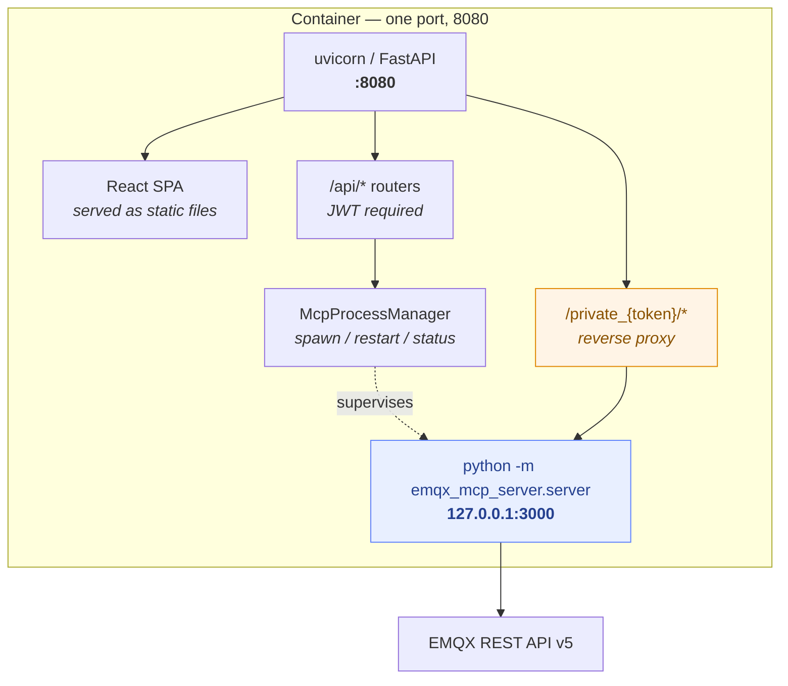
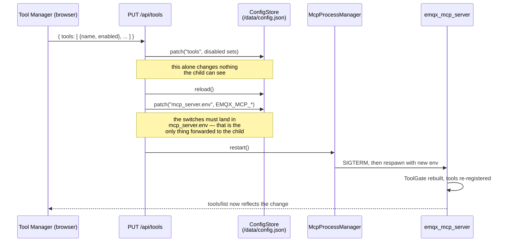
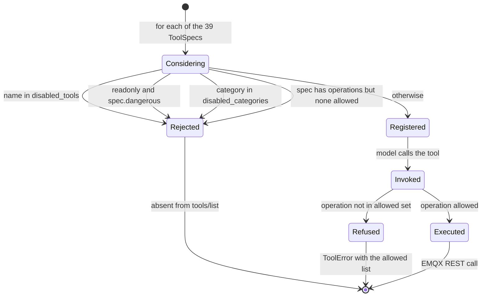
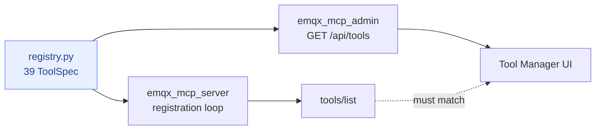
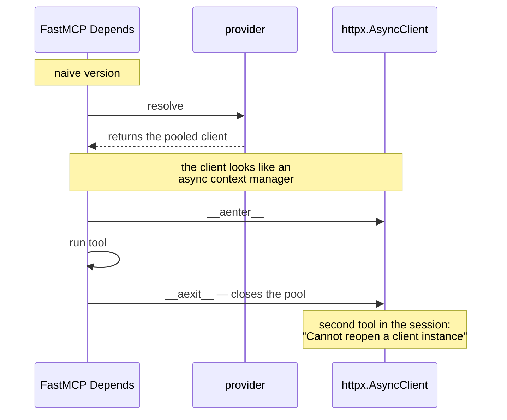
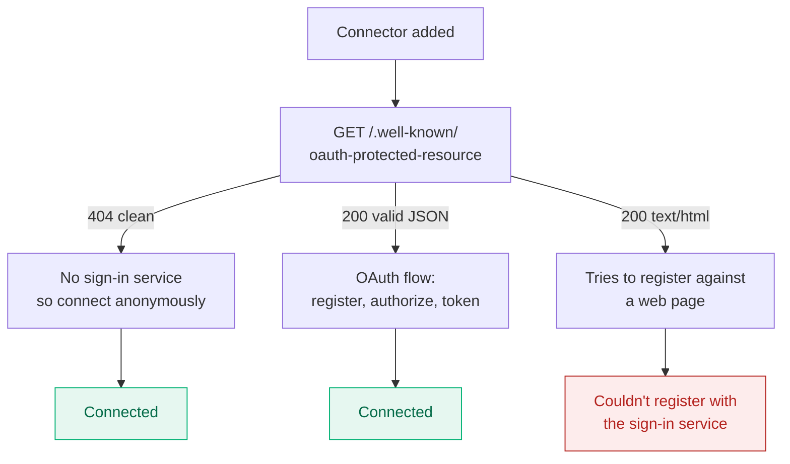
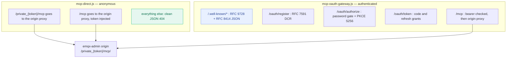
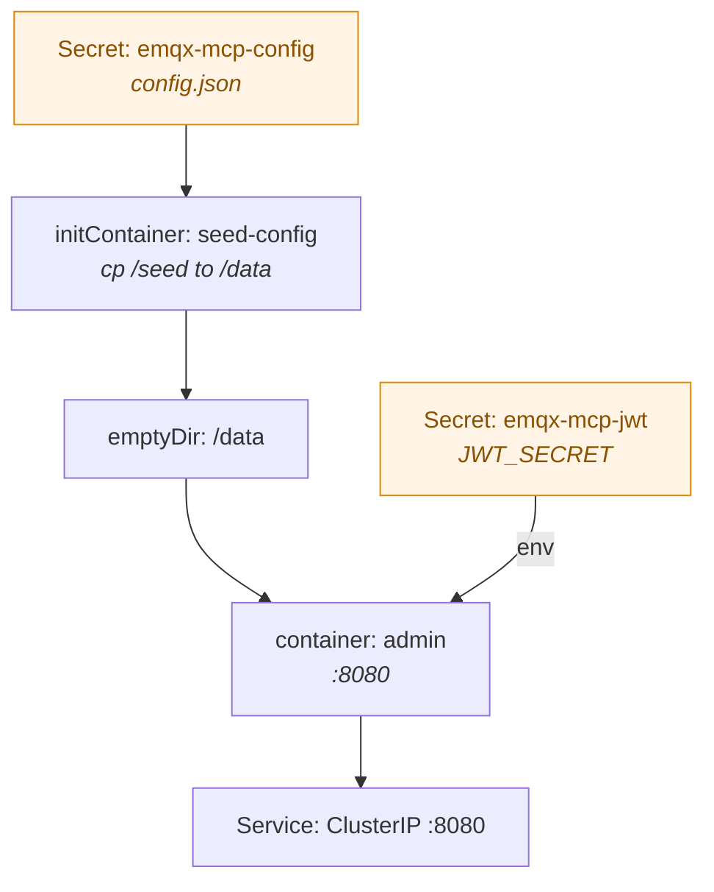

# Architecture

This document explains how the bundle is put together, what each layer is responsible for, and —
more usefully — which failure it exists to absorb. Every diagram below is Mermaid, so it renders
directly on GitHub.

- [The four processes](#the-four-processes)
- [Configuration flow](#configuration-flow)
- [The tool gate](#the-tool-gate)
- [Why the registry is shared](#why-the-registry-is-shared)
- [The EMQX client lifetime](#the-emqx-client-lifetime)
- [Why the edge layer exists](#why-the-edge-layer-exists)
- [Real-broker behaviours we absorb](#real-broker-behaviours-we-absorb)
- [Deployment](#deployment)

---

## The four processes

There is one container, one exposed port, and two processes inside it. The MCP server is a child
of the admin backend, supervised by `McpProcessManager`.



Two properties fall out of this shape and both are deliberate:

The MCP server binds to `127.0.0.1`, so nothing outside the container can reach it. The only way
in is the proxy, and the proxy will not forward without a matching token. If you ever find
yourself able to reach `:3000` from another host, something is misconfigured.

The MCP server is a *child process*, not an import. That is what makes the tool switches real:
changing them rewrites the child's environment and restarts it, so the tool list is rebuilt from
scratch. A disabled tool is not "blocked" — it was never registered.

---

## Configuration flow

This is the part that was wrong in the first implementation, and it is worth drawing precisely.
The GUI writes to the config store; the config store is *not* what the MCP server reads.



`mcp_admin_core.process` forwards only `connection` and `mcp_server.env` to the child. Writing the
switches into `tools` and stopping there produces a GUI that looks correct and an MCP surface that
never changes — the exact defect this project inherited and then fixed.
`tests/test_admin_tools_api.py` pins the env write; `tests/test_connection_wiring.py` pins the key
names.

---

## The tool gate



Three levels, in increasing granularity:

**Category** — switch off *Data Integration* and all six rule-engine tools disappear together.
Useful when a broker has no rules configured and you would rather the model not go looking.

**Tool** — the everyday control, one switch per tool.

**Operation** — for the two multi-operation tools (`emqx_manage_authn_users` and
`emqx_manage_authz_rules`) you can allow `read` while denying `create` and `delete`. The allowed
list is interpolated into the tool's description, so the model is told what it may do rather than
discovering it by being refused.

The **read-only master switch** is a fourth, blunter control: it drops every tool marked
`dangerous`, all 13 of them, regardless of the other settings. It is the right setting for an
assistant that should observe and never touch.

---

## Why the registry is shared

`emqx_mcp_server/registry.py` holds 39 `ToolSpec` entries — name, category, description,
operations, dangerous flag. Two very different consumers read it:



If the GUI had its own list, the two would drift the first time someone added a tool, and the
console would offer switches for tools that do not exist. `tests/test_mcp_surface.py` asserts that
the set of names the server registers equals the set the registry declares — so drift fails CI
rather than shipping.

---

## The EMQX client lifetime

A subtle bug worth documenting, because it will bite anyone building on FastMCP.

The server opens one pooled `httpx.AsyncClient` in its lifespan and injects it into every tool
through `Depends`. The obvious provider — return the client — is wrong:



FastMCP's dependency resolver enters and exits anything context-manager-like that a provider
returns. Returning the pooled client therefore closed it as soon as the first tool finished, and
every *second* call in a session failed. An async-generator provider does not help either — this
version of FastMCP passes the generator object straight through, and the tool receives something
with no `.request()`.

The fix is a plain object that owns nothing:

```python
class EmqxHttp:
    """A borrowed reference to the pooled client. Deliberately not closeable."""
    __slots__ = ("_client",)

    async def request(self, method, url, **kwargs):
        return await self._client.request(method, url, **kwargs)
```

`tests/test_client_lifetime.py` calls three different tools inside one session and asserts all
three succeed. It failed before the fix and passes after — which is the only way to be sure a bug
like this stays fixed.

---

## Why the edge layer exists

Claude's custom-connector flow runs OAuth discovery *before* it connects. What your server returns
for `/.well-known/oauth-protected-resource` decides everything that follows:



The middle branch is the trap. `mcp_admin_core` serves a React SPA with a catch-all route, so an
admin-console origin answers *every* unmatched path — including `/.well-known/*` — with
`200 text/html`. Discovery then believes a sign-in service exists, tries to register against an
HTML page, and fails.

That is why the MCP endpoint must not share a hostname with the admin console. Two Workers in
[`../cloudflare`](../cloudflare) give it one of its own:



Both Workers also fix a second trap. The origin answers `/private_{token}/mcp` — no trailing slash
— with a `307` to `https://localhost/mcp/`, because the redirect is built from the upstream's own
base URL. A cross-host redirect loses the request and would drop an `Authorization` header, and the
canonical URL form recommended for connectors is precisely the slashless one. The Workers always
append the slash before the request leaves the edge, so both forms work.

---

## Real-broker behaviours we absorb

These are not hypothetical; each was found by running against EMQX 5.8.8 and each is covered by a
test.

**Retained topics containing slashes.** `GET /mqtt/retainer/message/{topic}` rejects a slash inside
the path segment, and essentially every real topic is hierarchical. `emqx_get_retained` therefore
tries the direct path only for flat topics and otherwise walks the retained listing;
`emqx_delete_retained` falls back to publishing an empty retained message, which is how MQTT itself
clears a topic.

**Base64 payloads.** Retained payloads come back base64-encoded. They are decoded transparently,
with the raw value preserved if it is not valid UTF-8.

**Publishing into the void.** EMQX answers `202` with `reason_code 16` when a message was accepted
but nobody was subscribed. Left alone this looks like success, and "I published and nothing
happened" becomes a mystery. `emqx_publish` surfaces it as `delivered_to_subscribers: false` plus a
`broker_note`, which points the model at `emqx_list_subscriptions` next.

**Open-source vs enterprise.** `emqx_list_connectors` and `emqx_list_actions` return empty lists on
the open-source edition. That is normal, and the tool descriptions say so, so the model does not
report it as a fault.

---

## Deployment

The Kubernetes manifest keeps configuration in a Secret and seeds it into an `emptyDir` on every
start:



The Secret is the source of truth: because the init container copies it over `/data/config.json` on
every start, changes made through the GUI survive a restart of the *process* but not a restart of
the *pod*. That is intentional for a GitOps-style deployment — settle the configuration, then write
it back into the Secret. If you would rather the GUI be authoritative, replace the `emptyDir` with
a PersistentVolumeClaim and drop the init container.

For exposure, the Service stays ClusterIP and traffic arrives through a Cloudflare Tunnel. Note
that a remotely-managed tunnel (`config_src: "cloudflare"`) ignores any local `config.yaml`
ingress — routes must be added through the Cloudflare API or dashboard, and a local ConfigMap will
be silently ignored.
